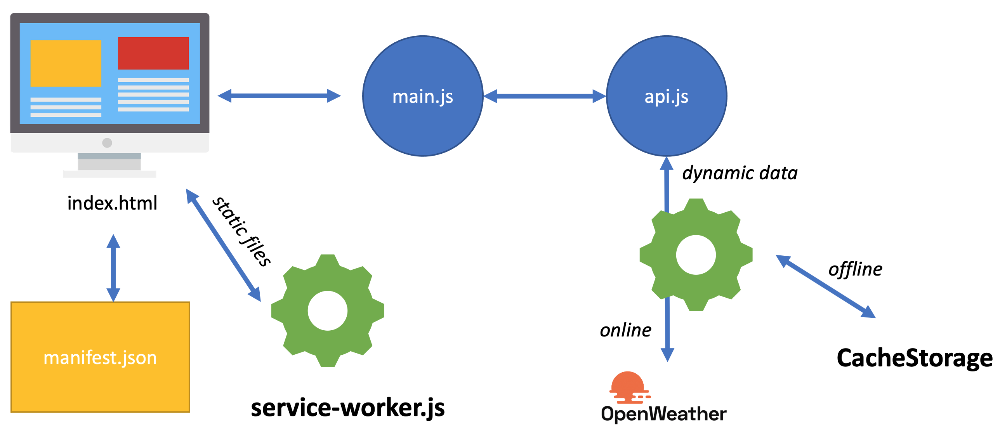

Weather App
===========

Progressive Web App demo for the [WebInt](http://www.eurecom.fr/en/course/WebInt-2020Fall) class at EURECOM.

Inspired by https://murillo94.github.io/weather-pwa/ .

# Install

Install a light server. I recommend `http-server`.

    npm install -g http-server

Start the server

    http-server

# Architecture

What we use:
- [Bulma](bulma.io) (Pure CSS Framework)   
- [jQuery](jquery.com)
- [OpenWeather API](openweathermap.org)
- Axios[https://github.com/axios/axios] (easy AJAX requests)

